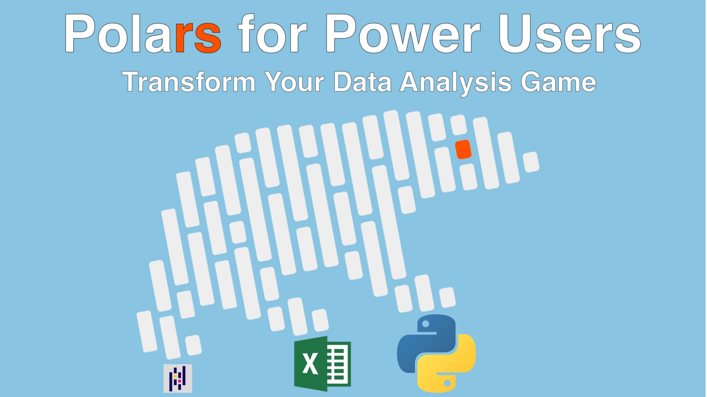

# Polars for Power Users Course
## Transform Your Data Analysis Game

**Unlock the full velocity of modern data science with Polars, the blazing-fast DataFrame library built in Rust and delivered in Python.** In this hands-on course you’ll move from spreadsheet limitations and  sluggish pandas workflows to lightning-quick analyses that handle *millions* of rows in the blink of an eye.

 Whether you’re wrangling CSVs, taming messy Excel files, or joining multi-gigabyte datasets, **"Polars for Power Users" shows you exactly how to translate everyday data tasks into clean, Pythonic code that runs 10-100× faster than traditional  approaches.** Through a pragmatic mix of short lectures, live  REPL sessions, and a capstone case study on global GDP, you’ll master  Polars’ expressive syntax, lazy evaluation engine, and  productivity-boosting features such as pivot tables, joins, and  Excel-style date accessors.

## What's this course about and how is it different?

Polars is a newcomer that combines the *ergonomics of pandas* with the **raw speed of a Rust-powered backend**. But switching libraries can feel daunting, documentation alone rarely answers *how* to migrate your day-to-day workflow.

**This course bridges that gap** by repeatedly showing an "Excel or pandas way" *next to* the Polars way, so you see concrete savings in typing, memory, and runtime with every lesson. You’ll learn not just *what* to type, but *why* Polars’ design, columnar storage, eager vs. lazy execution, and expression objects lead to simpler, safer code.

Each chapter builds toward a real-world case study: Merging GDP,  population, and R&D spending to create per-capita and percent-of-GDP insights. Along the way you’ll confront (and fix) dirty data,  inconsistent schemas, and multi-sheet spreadsheets, the headaches  analysts battle every day.

Finally, **you’ll leave with a GitHub repo of REPL sessions and finished scripts** you can use straight in your own projects, plus performance timings that prove why Polars earns its "power user" title.

## What You Will Learn

- **Install & configure Polars** with virtual environments (uv or pip) and a ready-to-clone GitHub repo.
- Build DataFrames from dictionaries, lists, and external files (CSV, Excel).
- Navigate **row slicing, negative indexing, `head()`, and `tail()`** without an explicit index column.
- Use **expressions as first-class objects** to reuse calculations across DataFrames.
- Add, rename, drop, and concatenate columns & rows with one-liner methods like `with_columns()` and `concat()`.
- **Filter data the Excel-quick-filter way** using Boolean masks, chained conditions, AND/OR combinations, and date accessors.
- Perform **aggregations & `group_by()`** to replace Excel's `SUMIF`, `COUNTIF`, and pivot tables.
- Handle nulls and duplicates: `fill_null()`, `drop_nulls()`, `is_unique()`, `value_counts()`.
- Clean messy types (percent strings, ZIP codes, floats-as-ints) with **casting and string/regex helpers**.
- **Join and merge** disparate files with inner, left, and custom key joins, no more VLOOKUPs.
- Export results to styled Excel workbooks via `xlsxwriter` and to super-large CSVs *far beyond* Excel’s 1-M-row limit.
- **Unlock lazy evaluation** (`scan_csv()`, `lazy()`, `collect()`) and read query plans with `explain()` for serious speed-ups.
- Optimize real workflows in the **GDP/Population/R&D case study**, producing KPIs like GDP per capita and R&D % of GDP.
- Adjust `polars.Config` to preview huge tables safely (`set_tbl_rows()`, `glimpse()`).
- Benchmark eager vs. lazy runs and understand when **Polars outperforms pandas by orders of magnitude**.

## Take  the course

[Take the full course at Talk Python](https://training.talkpython.fm/courses/polars-for-power-users?utm_source=github).

